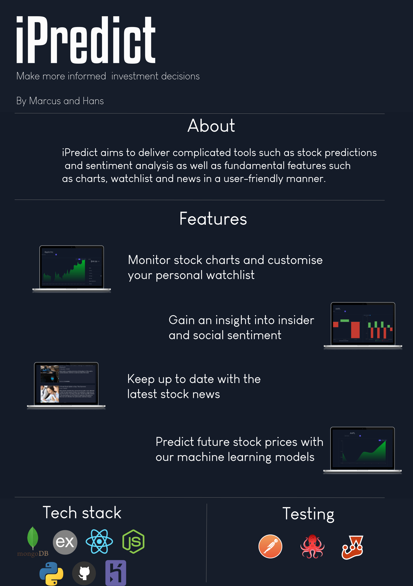

<!-- PROJECT LOGO -->
 

  

<h3 align="center">iPredict</h3>

  

    Check it out:
     
    <a href="https://ipredict.herokuapp.com/"><strong>Website</strong></a>
     
     
    <a href="https://bit.ly/3PCBK4i">Read the docs</a>
    ·
    <a href="https://github.com/Marcusgwj/iPredict/issues">Report Bug</a>
    ·
    <a href="https://github.com/Marcusgwj/iPredict/issues">Request Feature</a>
  

<!-- TABLE OF CONTENTS -->

  
Table of Contents

  <ol>
    <li> <a href="#about-the-project">About The Project</a></li>
    <li><a href="#built-with">Built With</a></li>
    <li><a href="#usage">Usage</a></li>
    <li><a href="#milestone-1">Milestone 1</a></li>
    <li><a href="#milestone-2">Milestone 2</a></li>
    <li><a href="#milestone-3">Milestone 3</a></li>
    <li><a href="#contributors">Contributors</a></li>
  </ol>

## About The Project

iPredict is a user-friendly platform for investors to gain vital information about their stocks.
Features such as insider and news sentiment as well as stock price predictions allow investors to gain an insight into
how the stock price may be affected.
Investors are also able to easily keep up with the latest stock prices and news.
iPredict helps investors make a more informed decision when buying or selling their stocks.

(<a href="#top">back to top</a>)

### Built With

- [MongoDB](https://www.mongodb.com/)
- [Express.js](https://expressjs.com/)
- [React.js](https://reactjs.org/)
- [Node.js](https://nodejs.org/en/)
- [Material UI](https://mui.com/)
- [Tailwind CSS](https://tailwindcss.com/)
- [Python](https://www.python.org/)

(<a href="#top">back to top</a>)

<!-- USAGE EXAMPLES -->

## Usage

[Sign in](https://ipredict.herokuapp.com/signin) as guest:

Or [Sign up](https://ipredict.herokuapp.com/signup) for your account

(<a href="#top">back to top</a>)

<!-- Milestone 1 -->

## Milestone 1

- [x] Home page
- [x] Sign in page
- [x] Sign up page
- [x] Authentication features
- [x] Live display of stock prices
- [x] Display of stock chart
- [x] Data mining from Yahoo Finance
- [x] Model training for stock predictions

<!-- Milestone 2 -->

## Milestone 2

- [x] Latest stock news
- [x] Insider sentiment
- [x] Social sentiment
- [x] Watchlist feature available only to signed in users
- [x] Improved home page
- [x] Improved authentication features
- [x] Improved stock chart

(<a href="#top">back to top</a>)

<!-- Milestone 3 -->

## Milestone 3

- [x] Deploy stock price prediction API
- [x] Stock price prediction page
- [x] Add user avatar and profile page
- [x] Password reset feature
- [x] Guest login feature

(<a href="#top">back to top</a>)

<!-- Contributors -->

## Contributors

- Marcus - https://github.com/Marcusgwj
- Hans - https://github.com/hansneddyanto

(<a href="#top">back to top</a>)

