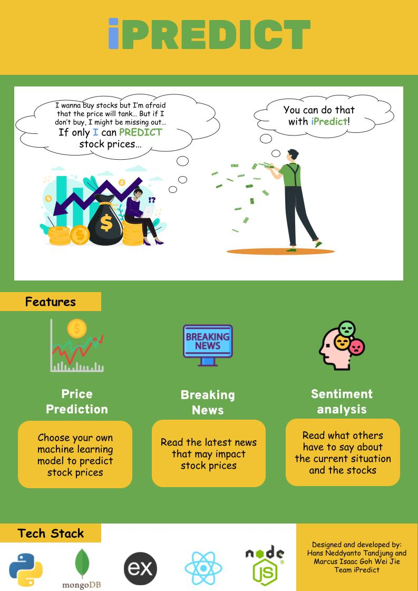

<!-- PROJECT LOGO -->
 

  

<h3 align="center">iPredict</h3>

  

    Check it out:
     
    <a href="https://ipredict.herokuapp.com/"><strong>Website</strong></a>
     
     
    <a href="https://github.com/Marcusgwj/iPredict">Explore the docs</a>
    ·
    <a href="https://github.com/Marcusgwj/iPredict/issues">Report Bug</a>
    ·
    <a href="https://github.com/Marcusgwj/iPredict/issues">Request Feature</a>
  

<!-- TABLE OF CONTENTS -->

  
Table of Contents

  <ol>
    <li> <a href="#about-the-project">About The Project</a></li>
    <li><a href="#built-with">Built With</a></li>
    <li><a href="#usage">Usage</a></li>
    <li><a href="#milestone-1">Milestone 1</a></li>
    <li><a href="#contributors">Contributors</a></li>
  </ol>

## About The Project

We aim to make a user-friendly website to easily visualise and understand stock predictions.
We want to help users make a more informed decision when buying or selling their stocks.
We also want to make stock predictions less intimidating for the general public.

(<a href="#top">back to top</a>)

### Built With

- [MongoDB](https://www.mongodb.com/)
- [Express.js](https://expressjs.com/)
- [React.js](https://reactjs.org/)
- [Node.js](https://nodejs.org/en/)
- [React Bootstrap](https://react-bootstrap.github.io/)
- [Material UI](https://mui.com/)
- [Tailwind CSS](https://tailwindcss.com/)
- [Python](https://www.python.org/)

(<a href="#top">back to top</a>)

<!-- USAGE EXAMPLES -->

## Usage

[Sign in](https://ipredict.herokuapp.com/signin) with test account:

- Email: test@gmail.com
- Password: test123

Or [Sign up](https://ipredict.herokuapp.com/signup) for your account

(<a href="#top">back to top</a>)

<!-- Milestone 1 -->

## Milestone 1

- [x] Home page
- [x] Sign in page
- [x] Sign up page
- [x] Authentication features
- [x] Live display of stock prices
- [x] Display of stock chart
- [x] Data mining from Yahoo Finance
- [x] Model training for stock predictions

(<a href="#top">back to top</a>)

<!-- Contributors -->

## Contributors

- Marcus - https://github.com/Marcusgwj
- Hans - https://github.com/hansneddyanto

(<a href="#top">back to top</a>)

